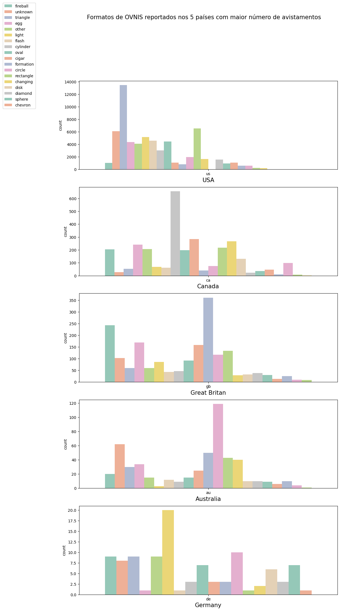

# Análise de Avistamentos de OVNIs 
Este projeto tem como objetivo analisar os avistamentos de OVNIs relatados ao redor do mundo, explorando os diferentes formatos de OVNI e os locais onde os avistamentos ocorrem com maior frequência.

Usei Pandas, Matplotlib e Seaborn para analisar quais são os formatos de OVNIs mais comuns em cada país e como eles se comparam entre si.

Para visualizar os resultados, criei um conjunto de subplots usando a função plt.subplots() e sns.countplot() do Seaborn para gerar gráficos de contagem para cada país. Depois, ajustei as legendas e os títulos para tornar a visualização mais clara.

# Dados Utilizados
Os dados utilizados nesta análise foram obtidos a partir da base de dados "UFO Sightings Around the World", disponibilizada no Kaggle. Essa base de dados contém informações sobre mais de 80.000 avistamentos de OVNI registrados em todo o mundo entre 1906 e 2017.

# Avistamentos de OVNI por Estado
Através desse mapa de calor é possível ver a distribuição dos avistamentos de OVNI por estado. Os estados mais afetados por avistamentos de OVNI são a Califórnia, Texas e West Virginia. É importante destacar que esse mapa de calor se baseia apenas em relatos registrados e, portanto, não representa a totalidade dos avistamentos de OVNI em cada estado.

# Formatos de OVNI nos 5 Países com Maior Número de Avistamentos
Neste gráfico é possível visualizar os diferentes formatos de OVNI registrados nos cinco países com maior número de avistamentos: Estados Unidos, Canadá, Reino Unido, Austrália e Alemanha. 

# Formatos de OVNI Mais Comuns
Nesse gráfico é possível visualizar os formatos de OVNI mais comuns registrados ao longo do período de 20 anos. O formato mais comum é o "objeto luminoso", seguido pelo "disco voador" e o "triângulo voador".

# Conclusão
A análise revela que esses eventos são amplamente relatados em todo o planeta, com diferenças geográficas e de formatos de objetos avistados. Embora a natureza desses eventos ainda seja desconhecida e gere muitas controvérsias, a disponibilidade de grandes quantidades de dados como a utilizada nesta análise, pode ajudar a lançar luz sobre esses eventos e a entender melhor esses fenômenos. Pesquisas adicionais devem ser conduzidas para identificar os fatores que contribuem para esses avistamentos e para entender melhor a sua natureza e origem.

